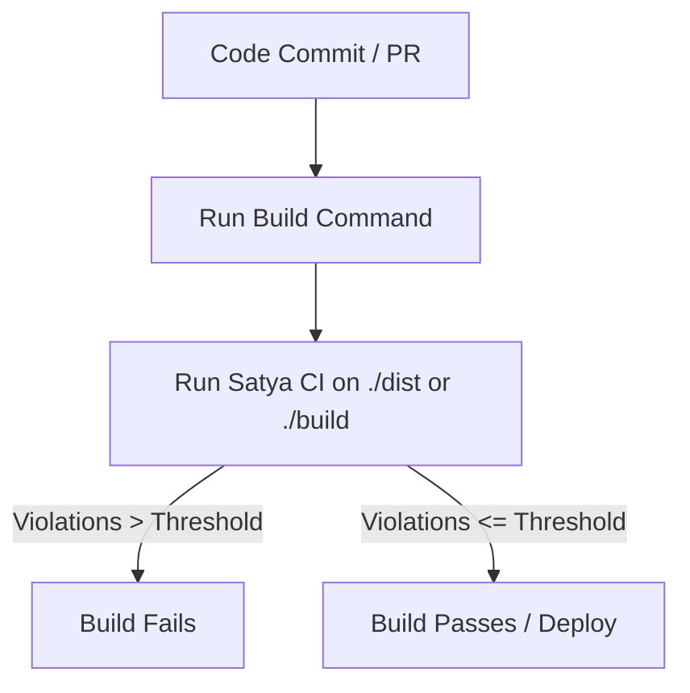

# Satya CI - General Project Integration Guide

This guide details how to integrate the **Satya CI** accessibility testing tool into any software project, regardless of its tech stack (React, Vue, Angular, Svelte, static HTML, Python/Django, Ruby on Rails, PHP, etc.).

By incorporating Satya CI as a quality gate in your development lifecycle, you can automate accessibility compliance audits and prevent accessibility regressions from reaching production.

---

## 📋 Integration Checklist

Before beginning the integration, verify that your project and environment meet these prerequisites:

1. **Target Web Application**: An application that can either be built into a directory of static files (HTML, JS, CSS) or run as a local/remote HTTP server.
2. **Environment Options**:
   - **Node.js Environment**: Node.js 18.0.0 or higher.
   - **Docker Environment**: A container execution runtime (e.g., Docker, Kubernetes) if you prefer containerized testing.

---

## 🛠️ Step 1: Install Satya CI in Your Project

Depending on your preference and build pipeline, you can use any of the three integration methods:

### Option A: Local NPM Development Dependency (Recommended)

Installing the tool as a development dependency ensures that all contributors run the same pinned version of the accessibility engine.

```bash
# Using npm
npm install --save-dev satya-engine-ci

# Using yarn
yarn add -D satya-engine-ci

# Using pnpm
pnpm add -D satya-engine-ci
```

### Option B: Run On-The-Fly with NPX

If you prefer not to add packages to your project's `package.json`, you can run the tool dynamically using `npx`:

```bash
npx satya-ci --target <target-url-or-dir> --threshold 0
```

### Option C: Containerized Execution (Docker)

If your CI/CD environment does not have Node.js or you want to avoid installing browser dependencies, use the pre-built Docker image:

```bash
docker run --rm -v $(pwd)/reports:/app/reports ghcr.io/your-org/satya-engine-ci:latest --target https://example.com
```

> [!NOTE]
> Ensure that you replace `ghcr.io/your-org/satya-engine-ci:latest` with the actual path of your built or hosted container image.

---

## ⚙️ Step 2: Configure Satya CI

Create a `.satyarc.json` file in the root of your project. This configuration standardizes the test parameters, severity thresholds, and element exclusions across both local development environments and CI runs.

Here is a comprehensive template for `.satyarc.json`:

```json
{
  "rules": {
    "color-contrast": { "enabled": true, "severity": "critical" },
    "image-alt": { "enabled": true, "severity": "high" },
    "button-name": { "enabled": true, "severity": "medium" }
  },
  "ignoreDom": [
    ".dev-tools-panel",
    "#temporary-banner",
    "[data-a11y-ignore]"
  ],
  "viewport": {
    "width": 1280,
    "height": 800
  },
  "timeout": 30000,
  "waitAfterNavigation": 2000,
  "output": "./reports"
}
```

> [!TIP]
> **Exempting Elements**: Use the `ignoreDom` array to skip checking known issues (like third-party widgets, chatbots, or debugging elements) that you cannot modify. Adding a data attribute like `[data-a11y-ignore]` is an excellent way to flag specific DOM nodes to be skipped.

---

## 🚀 Step 3: Choose Your Pipeline Strategy

There are two primary ways to run accessibility testing in a build pipeline: **Local Pre-Deployment Testing** and **Staging/Preview Post-Deployment Testing**.

### Strategy 1: Local Pre-Deployment Testing (Build Artifacts)

This strategy runs tests against your static build directory or a local dev server *before* code is deployed. This is fast, cheap, and catches issues early.



#### Run against a static build folder:
If your project outputs static HTML files (e.g. Next.js static exports, Vite, Create React App, Jekyll, Hugo):

```bash
npx satya-ci --target ./dist --threshold 0
```
*Satya CI will automatically spin up an internal web server on a free port, index your static pages, run the browser checks, and clean up the server when finished.*

#### Run against a locally running dev/preview server:
If your app needs a server running (e.g. Next.js SSR, Express, Django):
1. Start your application server in the background.
2. Wait for it to become responsive (e.g., using `wait-on`).
3. Run `satya-ci` against the local address.
4. Shut down the server.

Example npm scripts:
```json
{
  "scripts": {
    "serve:preview": "npm run build && npx serve -p 3000 build",
    "test:a11y": "npx wait-on http://localhost:3000 && npx satya-ci --target http://localhost:3000 --threshold 0"
  }
}
```

### Strategy 2: Post-Deployment / Deploy-Preview Testing

This strategy runs tests against a live URL (e.g., an ephemeral Netlify/Vercel preview link, staging, or QA environment) after a pull request deployment completes.

```bash
npx satya-ci --target https://preview-pr-12.yourdomain.com --threshold 0
```

---

## 🚦 Step 4: Quality Gates and Exit Codes

Satya CI controls pipeline execution via standard terminal exit codes:

| Exit Code | Pipeline Outcome | Condition |
| :---: | :---: | :--- |
| **`0`** | **Pass** (Green) | Total accessibility violations is less than or equal to the `--threshold` limit. |
| **`1`** | **Fail** (Red) | Total accessibility violations exceed the `--threshold` limit, or execution failed due to an error. |

### Enforcing Strict vs. Baseline Compliance

1. **Strict Mode (Greenfield Projects)**: Set `--threshold 0` to ensure no new accessibility violations can be introduced.
2. **Baseline Mode (Legacy Projects)**: If you have an existing application with known violations, you can set the threshold to the current count of errors (e.g., `--threshold 15`) and gradually lower it as you fix violations.

---

## 📂 Archiving Reports and Artifacts

Satya CI automatically exports two file formats inside the output directory (default: `./reports`):

1. **`satya-report.json`**: A machine-readable payload containing full details of the violations, severities, and DOM selectors. Use this file for automated audits, compliance tracking, or custom reporting dashboards.
2. **`satya-report.html`**: A highly interactive, self-contained HTML report with a visual summary, search filters, and code highlights. Archive this in your CI system for developers to inspect when a build fails.

### Standard CI Artifact Archiving Pattern

```bash
# Run Satya CI
npx satya-ci --target ./build --threshold 0 --output ./a11y-reports

# The CI pipeline config should be set to always upload ./a11y-reports/
# even when the previous test step fails (exit code 1).
```

---

## 🐳 Running inside Containerized CI Environments

Running Puppeteer/Chromium inside headless Docker containers sometimes requires specific runtime options due to sandboxing constraints.

### Automatic Sandboxing Exemption
Satya CI automatically detects container environments and applies the `--no-sandbox` flags if:
- It finds a `/.dockerenv` file.
- The environment variable `SATYA_NO_SANDBOX=true` is set.
- The environment variable `NO_SANDBOX=true` is set.

If you hit sandbox permission errors in custom container environments, inject the environment variable:

```bash
# In your CI environment configuration
export NO_SANDBOX=true
```

### Docker Volume Mounting (Saving Reports)
To extract the generated HTML/JSON reports from the container, mount your host workspace directory to the container's `/app/reports` path:

```bash
docker run --rm \
  -v $(pwd)/reports:/app/reports \
  ghcr.io/your-org/satya-engine-ci:latest \
  --target https://example.com
```

---

## 🔗 Referencing Platform-Specific Guides

For pre-written configuration files for specific platforms, see:
* [GitHub Actions Configuration Guide](./ci-cd-examples.md#github-actions)
* [GitLab CI Configuration Guide](./ci-cd-examples.md#gitlab-ci)
* [Jenkins Pipeline Configuration Guide](./ci-cd-examples.md#jenkins)
* [CircleCI Configuration Guide](./ci-cd-examples.md#circleci)
* [Azure DevOps Configuration Guide](./ci-cd-examples.md#azure-devops)
* [Bitbucket Pipelines Configuration Guide](./ci-cd-examples.md#bitbucket-pipelines)
